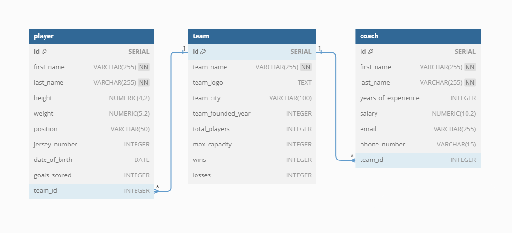

# Sports League Management Application

A full-stack web application to manage teams, players, and coaches in a soccer league.

## Deployment
- The app is deployed on **Render**:
- Will take 2-3 minutes to fully load frontend and backend intially since it's deployed on a free tier.
   - Frontend: [Deployed URL](https://soccer-league-manager.onrender.com)
   - Backend: [Deployed API URL](https://mean-project-1-a0j5.onrender.com)

## Table of Contents
- [Features](#features)
- [Technologies](#technologies)
- [Setup and Installation](#setup-and-installation)
- [API Documentation](#api-documentation)
- [Database](#database)

## Features
- Manage teams, players, and coaches.
- CRUD operations for teams, players, and coaches.
- Team player count auto-updates with PostgreSQL triggers.
- Max capacity enforcement for teams.
- Frontend with Tailwind CSS and Preline components.

## Technologies
- **Frontend**: Angular, Tailwind CSS, Preline
- **Backend**: Node.js, Express.js, TypeORM
- **Database**: PostgreSQL

## Setup and Installation

1. Clone the repository:
   ```bash
   git clone https://github.com/your-repo/sports-league-management.git
   cd sports-league-management
   ```

2. Create PostgreSQL Database with Create-Table.sql script in /Database
   
2. Start Backend
   ```bash
   cd Backend
   npm install
   ```

   Set up backend environment variables by creating .env file in /Backend
    ```bash
    PORT=express_port
    NODE_ENV=dev
    DB_HOST=localhost
    DB_PORT=5432
    DB_USER=postgres
    DB_PASSWORD=db_password
    DB_DATABASE=db_name
    CORS_WHITELIST=ip,ip,ip
    ```
    
   Run the server
   ```bash
   npm run start
   ```

3. Start Frontend
   ```bash
   cd Frontend
   npm install
   npm run start
   ```
   
   Change environment files in src/environments/ to connect to your backend


## API Documentation

### **Base URL**: `/api`

### Routes:

#### 1. **Team**
- `GET /api/team`: Get all teams.
- `POST /api/team`: Create a new team.
- `GET /api/team/:id`: Get a specific team by ID.
- `PUT /api/team/:id`: Update a team by ID.
- `DELETE /api/team/:id`: Delete a team by ID.

#### 2. **Player**
- `GET /api/player`: Get all players.
- `POST /api/player`: Create a new player.
- `GET /api/player/:id`: Get a specific player by ID.
- `PUT /api/player/:id`: Update a player by ID.
- `DELETE /api/player/:id`: Delete a player by ID.

#### 3. **Coach**
- `GET /api/coach`: Get all coaches.
- `POST /api/coach`: Create a new coach.
- `GET /api/coach/:id`: Get a specific coach by ID.
- `PUT /api/coach/:id`: Update a coach by ID.
- `DELETE /api/coach/:id`: Delete a coach by ID.

## Database
- PostgreSQL is used for storing team, player, and coach data.
- Triggers and functions handle business logic like updating `total_players` and enforcing team capacity.

### Tables:
- **Team**: Stores team details.
- **Player**: Stores player details.
- **Coach**: Stores coach details.

### Entity Relational Diagram:

